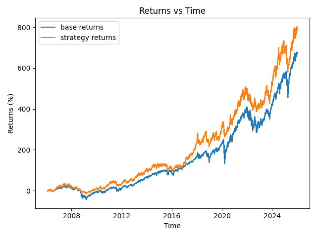

# Vectorised Volatility-Targeting Backtester

This backtester follows a **volatility-targetting strategy**, using a rolling 20-day window to calculate the realized volatility of an asset, and adjusting the weight of a long position in order to maintain overall volatility at a target level.

## Results

| Asset | Base Sharpe | Strategy Sharpe | Base Max. Drawdown | Strategy Max. Drawdown |
| :--- | :---: | :---: | :---: | :---: |
| **NVDA** | 1.18 | 1.27 | -60.80% | -18.75% |
| **SPY** | 0.35 | 0.46 | -55.19% | -37.61% |
| **AMZN** | 0.20 | 0.30 | -51.68% | -21.42% |
| **PHM** | 0.54 | 0.84 | -38.01% | -19.54% |

## How it works

**Data Collection:**
Data is taken from Yahoo Finance using the **yfinance** python library and returned as a dataframe. Dates can be specified when calling the function, or left blank to use the default range of 2020-2026

**Realised Volatility Calculation:**
Log percentage returns are calculated using the formula $$r_t = \ln\left(\frac{P_t}{P_{t-1}}\right)$$ which then becomes realised volatility with the formula $$\sigma_t = \sqrt{\frac{\Sigma_{i=1}^{N}(r_{t-i}-\overline{r})^2}{N-1}} \cdot \sqrt{252}$$ where N is our rolling window (default value of 20), and the square root of 252 works to annualise our volatility.

**Returns calculation:**
To calculate our returns, we first use our weight given by $$\omega_t = \frac{\sigma_{target}}{\sigma_t}$$ clipping off any values over our max Leverage (default of 2) for our asset. This is recalculated every day using our rolling realised volatility, becoming returns through the formula $$R_{p,t} = \omega_tR_{a,t}+(1-\omega_t)R_{f,t} - C_t$$ where $R_{p,t}$ are portfolio returns at t, $R_{a,t}$ are asset returns at t, $R_{f,t}$ are returns on treasury bonds at t, and $C_t$ are transaction costs (default of 0.05% multiplied by the absolute change in weight).

**Data analysis:**
Sharpe ratio, annualized returns, max drawdowns, and annual volatility are calculated for the base asset (buy and hold) and for the strategy returns. Then, MatPlotLib is used to graph both returns over time.

## Key Highlight: Volatility-targetted SPY over 20 years

By reducing weight in periods of high volatility and instead putting them into treasury bonds, we are able to increase the Sharpe ratio by 0.11, decrease max drawdowns by 17.58%, and obtain higher returns than the asset over a 20-year period.

## Future Steps:
To extend this project further, I would like to combine it with another strategy, as volatility-targeting can be applied to reduce risk in almost all scenarios. Additionally, expanding from a singular asset to dividing capital among a portfolio of assets is another interesting application that I am interested in exploring later in the future. Finally, one important addition to improve the performance of the bot is switching from a simple moving average to an exponentially weighted moving average when calculating volatility in order to react faster to recent changes in volatility.

